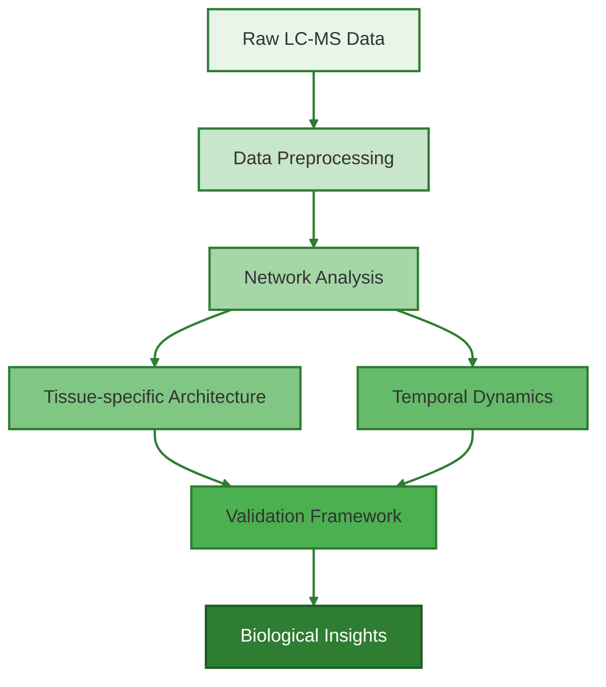
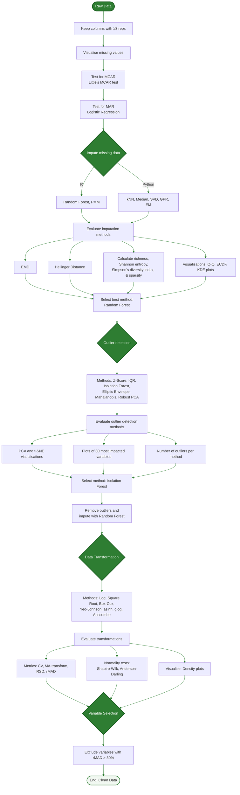

# 🌾 Tissue-specific Metabolomic Networks Orchestrate Osmotic Stress Adaptation in Wheat

*Uncovering the architectural principles of drought tolerance through integrated metabolomic-network analysis*

## 🎯 Project Overview
This repository contains the analytical pipeline used to investigate how wheat plants adapt to drought stress through tissue-specific metabolic networks. Our study reveals that drought-tolerant wheat varieties maintain distinct molecular organisations in leaves versus roots - leaves show highly integrated networks optimised for rapid photosynthetic responses, while roots display modular networks suited for localised environmental adaptation. These architectural differences help explain how some wheat varieties better withstand drought conditions.

Key findings:
- Identified fundamental differences in how leaves and roots organise their molecular responses to drought
- Discovered that drought-tolerant wheat has ~40% denser leaf networks compared to roots
- Found that leaf-root coordination changes over time as drought stress continues
- Validated findings using rigorous statistical approaches

### Workflow Overview


### Core Capabilities
- Analysis of 2,471 molecular features across tissues
- Advanced network topology analysis
- Bayesian network validation framework
- Comprehensive temporal dynamics assessment

## 🔑 Keywords
`metabolomics` `network-analysis` `drought-tolerance` `wheat` `systems-biology` `temporal-dynamics` `tissue-specific-metabolism` `LC-MS` `bioinformatics` `plant-science` `osmotic-stress` `metabolic-networks`

## 🏗️ System Architecture

### Analysis Pipeline Structure
```
📦 Metabolomics-Analysis-Pipeline
 ├── 📂 data                          
 │
 ├── 📂 src                           
 │   ├── 📂 1_data_preprocessing    # Data pre-processing scripts
 │   │   ├── feature_filter.py       # Initial feature filtering
 │   │   ├── missing_vis.py          # Missing value visualisation
 │   │   ├── mar_test.py             # Missing at Random test
 │   │   ├── logistic_test.py        # Logistic regression test
 │   │   ├── mcar_test.py            # Missing Completely at Random test
 │   │   ├── median_impute.py        # Median imputation
 │   │   ├── rf_impute.R             # Random Forest imputation
 │   │   ├── ml_impute.py            # Machine learning imputation
 │   │   ├── impute_validate.py      # Imputation validation
 │   │   ├── impute_dist_check.py    # Distribution check after imputation
 │   │   ├── isolation_forest.py      # Isolation Forest for outliers
 │   │   ├── dim_reduce_outliers.py   # Dimensionality reduction for outliers
 │   │   ├── outlier_vis.py           # Outlier visualisation
 │   │   ├── transform_data.py        # Data transformation
 │   │   ├── normality_test.py        # Normality testing
 │   │   ├── normality_vis.py         # Normality visualisation
 │   │   ├── transform_metrics.py      # Transformation metrics
 │   │   ├── transform_eval.py         # Transformation evaluation
 │   │   ├── variance_calc.py          # Variance calculation
 │   │   └── diversity_metrics.py      # Diversity metrics calculation
 │   │
 │   ├── 📂 2_analysis                # Main analysis scripts
 │   │   ├── ini_analysis.py            # Final preprocessing
 │   │   ├── ini_analysis_summary.py    # Preprocessing summary
 │   │   ├── stat_tests.py            # Statistical tests
 │   │   ├── pls_tissue.py            # PLS analysis by tissue
 │   │   ├── spearman_network.py      # Spearman correlation network
 │   │   ├── network_decay.py         # Network decay analysis
 │   │   ├── network_summary.py       # Network summary
 │   │   ├── baysian_network.R        # baysian network
 │   │   ├── tissue_analysis.R        # Tissue-specific analysis
 │   │   └── tissue_summary.R         # Tissue analysis summary
 │   │
 │   ├── 📂 3_visualisation           # Plotting scripts
 │   │   ├── 📂 figure1              
 │   │   │   ├── network_vis.py      # Network visualisation
 │   │   │   ├── radar_plot.R        # Radar plot
 │   │   │   ├── bayesian_crosstalk.R # Bayesian network analysis
 │   │   │   ├── hub_dist.R          # Hub distribution
 │   │   │   ├── hub_decay.R         # Hub decay
 │   │   │   ├── module_org.R        # Module organisation
 │   │   │   ├── module_stability.R  # Module stability
 │   │   │   └── temporal_stability.R # Temporal stability
 │   │   │
 │   │   ├── 📂 figure2
 │   │   │   ├── tissue_temporal.R   # Tissue temporal analysis
 │   │   │   ├── temporal_corr.R     # Temporal correlation
 │   │   │   └── tissue_plot.R       # Tissue plotting
 │   │   │
 │   │   └── 📂 figure3
 │   │       └── validation_vis.R     # Validation visualisation
 │   │
 │   └── 📂 4_chemical_identification # Chemical ID scripts
 │       ├── hmdb_annotate.py         # HMDB annotation
 │       ├── gnps_annotate.py         # GNPS annotation
 │       ├── struct_classify.py       # Structural classification
 │       └── func_group.py            # Functional group analysis
 │
 ├── 📂 3D_figures                    # Interactive plot
 ├── 📂 images                         # Images
 ├── requirements.txt                  # Dependencies
 ├── environment.yaml                  # Configuration 
 └── README.md                         # Project overview


```

## 📊 Key Findings

| Network Property | Leaves | Roots |
|-----------------|--------|--------|
| Network Density | 0.354 | 0.192 |
| Transitivity | 0.740-0.804 | 0.686-0.714 |
| Modularity | 0.097-0.162 | 0.213-0.288 |
| Components | 6 | 18-21 |


## 🚀 Technical Stack

### Core Analysis Pipeline
- **Data Processing**: 
  - Pandas/NumPy (data manipulation)
  - scikit-learn (machine learning)
  - RDKit (chemical analysis)
  
- **Network Analysis**:
  - NetworkX (network construction)
  - igraph (community detection)
  - bnlearn (Bayesian networks)

- **Visualization**:
  - Matplotlib/Seaborn
  - ggplot2
  - Plotly (interactive plots)

## 🛠️ Installation & Setup


### Quick Start

1. **Clone Repository**
   ```bash
   git clone https://github.com/shoaibms/metabo-net.git
   cd metabo-net
   ```

2. **Setup Python Environment**
   ```bash
   # Create and activate environment
   conda env create -f environment.yaml
   conda activate my_environment
   
   # Install additional requirements
   pip install -r requirements.txt
   ```

3. **Setup R Environment**
   ```bash
   # Create and activate R environment
   conda env create -f environment_r.yaml
   conda activate r_env
   
   # Install R packages
   Rscript -e "source('requirements_r.txt')"
   ```

### Verify Installation
```bash
# Test Python setup
python src/1_data_preprocessing/feature_filter.py --test

# Test R setup
Rscript src/2_analysis/tissue_analysis.R --test
```

### Troubleshooting
Common issues and solutions:
- **Python package conflicts**: `conda env update -f environment.yaml`
- **R package installation fails**: `conda install -c conda-forge r-essentials`
- **Missing dependencies**: Check both `requirements.txt` and `requirements_r.txt`

## 📊 Key Network Properties

| Property | Leaves | Roots | Impact |
|----------|--------|--------|---------|
| Network Density | 0.354 | 0.192 | Higher leaf density enables rapid stress response |
| Transitivity | 0.740-0.804 | 0.686-0.714 | Better leaf network coordination |
| Modularity | 0.097-0.162 | 0.213-0.288 | Root networks more compartmentalized |
| Components | 6 | 18-21 | Roots show more independent modules |


# 📈 Analysis Pipeline
Our metabolomics data analysis pipeline consists of four major phases, with comprehensive preprocessing steps to ensure data quality and reliability.

## Detailed Data Preprocessing Workflow



## Pipeline Overview

### 1️⃣ Data Preprocessing


### 2️⃣ Network Construction
Building on the clean dataset, we constructed:
- Spearman correlation networks (|r| > 0.7)
- Tissue-specific topology analysis
- Module detection using Louvain algorithm
- Hub identification and analysis

### 3️⃣ Temporal Analysis
Tracking network dynamics through:
- Cross-tissue correlation analysis
- Network stability assessment
- Module preservation analysis
- Pathway-level temporal patterns

### 4️⃣ Validation Framework
Ensuring reliability through:
- Bootstrap validation (n=5,000)
- Permutation testing
- Bayesian network validation
- Multiple null model comparisons

## 🔍 Quality Metrics
- Initial features: 4,255 (negative mode), 3,199 (positive mode)
- Final clean dataset: 2,471 molecular features
- Network validation: P < 0.001 (Bayesian analysis)

## 📚 Citation
If you use this pipeline in your research, please cite:
[Citation information will be added upon publication]

## 📝 License
This project is licensed under the MIT License - see the LICENSE file for details.
