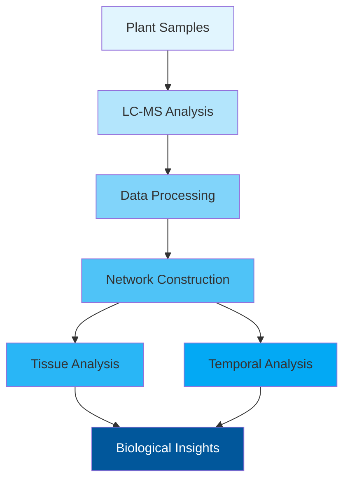

# 🌾 Tissue-specific Metabolomic Networks Orchestrate Osmotic Stress Adaptation in Wheat

## 🎯 Project Overview
This repository contains the analytical pipeline used to investigate how wheat plants adapt to drought stress through tissue-specific metabolic networks. Our study reveals that drought-tolerant wheat varieties maintain distinct molecular organizations in leaves versus roots - leaves show highly integrated networks optimized for rapid photosynthetic responses, while roots display modular networks suited for localized environmental adaptation. These architectural differences help explain how some wheat varieties better withstand drought conditions.

Key findings:
- Identified fundamental differences in how leaves and roots organize their molecular responses to drought
- Discovered that drought-tolerant wheat has ~40% denser leaf networks compared to roots
- Found that leaf-root coordination changes over time as drought stress continues
- Validated findings using rigorous statistical approaches

### Visual Overview



## 🛠️ Installation & Setup

### Prerequisites
- Python 3.8+
- R 4.0+
- Conda package manager

### Quick Start

1. **Clone Repository**
   ```bash
   git clone https://github.com/shoaibms/metabo-net.git
   cd metabo-net
   ```

2. **Setup Python Environment**
   ```bash
   # Create and activate environment
   conda env create -f environment.yaml
   conda activate my_environment
   
   # Install additional requirements
   pip install -r requirements.txt
   ```

3. **Setup R Environment**
   ```bash
   # Create and activate R environment
   conda env create -f environment_r.yaml
   conda activate r_env
   
   # Install R packages
   Rscript -e "source('requirements_r.txt')"
   ```

### Verify Installation
```bash
# Test Python setup
python src/1_data_preprocessing/feature_filter.py --test

# Test R setup
Rscript src/2_analysis/tissue_analysis.R --test
```

### Troubleshooting
Common issues and solutions:
- **Python package conflicts**: `conda env update -f environment.yaml`
- **R package installation fails**: `conda install -c conda-forge r-essentials`
- **Missing dependencies**: Check both `requirements.txt` and `requirements_r.txt`

## 📊 Key Network Properties

| Property | Leaves | Roots | Impact |
|----------|--------|--------|---------|
| Network Density | 0.354 | 0.192 | Higher leaf density enables rapid stress response |
| Transitivity | 0.740-0.804 | 0.686-0.714 | Better leaf network coordination |
| Modularity | 0.097-0.162 | 0.213-0.288 | Root networks more compartmentalized |
| Components | 6 | 18-21 | Roots show more independent modules |

## 📚 Citation
If you use this pipeline in your research, please cite:
[Citation information will be added upon publication]

## 📝 License
This project is licensed under the MIT License - see the LICENSE file for details.

For detailed documentation and tutorials, please visit our [Wiki](docs/)